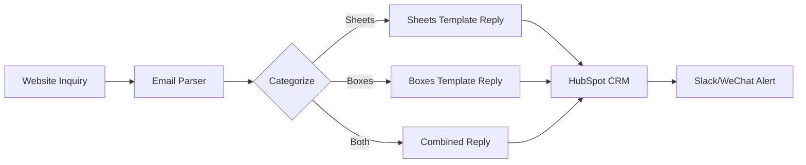

# Automated Trading & Business Operations Plan

## Overview
End-to-end automation system for the PP hollow board trading business — from inquiry to delivery.

---

## 1. Inquiry → CRM Automation

### Pipeline
```
Website Form / Email → Auto-classify → CRM → Auto-response
```

### Free Stack
- **HubSpot CRM** (free): Track leads, deals, pipeline
- **Google Sheets**: Lightweight CRM alternative
- **n8n** (self-hosted, free): Workflow automation

### Automation Workflow (n8n)



### Email Auto-Reply Templates

**For Sheet Inquiries:**
```
Subject: RE: PP Hollow Sheet Inquiry — Thank You!

Dear [Name],

Thank you for your interest in our PP hollow sheets.

Please confirm the following details for an accurate quote:
1. Thickness (2mm, 4mm, 5mm, 8mm, etc.)
2. Sheet size (length × width)
3. Color (RAL code if available)
4. Quantity
5. Destination port/country

We'll reply with a competitive FOB/CIF quote within 24 hours.

Best regards,
[Sales Team]
```

**For Box Inquiries:**
```
Subject: RE: Custom PP Box Inquiry — Quick Quote

Dear [Name],

Thank you for reaching out about our PP corrugated boxes.

To prepare your custom quote, please provide:
1. Inner dimensions (L × W × H)
2. Material thickness (2-8mm)
3. Color preference
4. Printing requirements
5. Quantity
6. Destination

Looking forward to serving you!

Best regards,
[Sales Team]
```

---

## 2. Quotation Automation

### Pricing Database (Google Sheets)

| Product | Specification | Unit Price (FOB) | MOQ | Lead Time |
|---------|--------------|-------------------|-----|-----------|
| Standard Sheet | 4mm × 1200×2400mm | $2.50/sheet | 500 pcs | 7-10 days |
| Heavy Sheet | 8mm × 1500×3000mm | $5.80/sheet | 300 pcs | 10-15 days |
| ESD Sheet | 4mm × 1200×2400mm | $3.80/sheet | 500 pcs | 10-12 days |
| Standard Box | 400×300×200mm | $1.20/pc | 1000 pcs | 10-15 days |
| Custom Box | Custom size | Quote on demand | 2000 pcs | 15-20 days |

### Auto-Quotation Formula
```
Total Price = Unit Price × Quantity
Freight = QUOTATION_API(weight, volume, destination)
CIF Price = Total Price + Freight + Insurance
```

### n8n Workflow: Auto-Quote Generation
```
Email Inquiry → Parse specs → Lookup pricing sheet → 
Calculate FOB/CIF → Generate PDF quote → Reply email
```

---

## 3. Order Management Automation

### Order Lifecycle
```
Quote Accepted → Order Confirmed → Production → 
QC Inspection → Shipping → Documentation → Delivery
```

### Status Tracking (GitHub Project / Trello)
| Stage | Action | Trigger |
|-------|--------|---------|
| Inquiry | Create card | Email arrives |
| Quoted | Update price field | Quote sent |
| Confirmed | Move to "In Production" | PO received |
| Produced | Attach QC photos | Production report |
| Shipped | Add tracking number | Bill of lading received |
| Delivered | Close card | Customer confirms |

### Automated Production Schedule
```
Monday: Consolidate all confirmed orders
Tuesday: Generate production order sheets
Wednesday: Send to factory floor
Daily: Update production progress (text message from workshop)
Friday: Weekly shipping schedule
```

---

## 4. Logistics & Shipping Automation

### Shipping Calculator Integration
- Use free APIs: **ShippingEasy**, **Freightos**, or manual rate tables
- Auto-compare: Sea (LCL/FCL) vs Air vs Rail

### FOB / CIF Auto-Calculation
```python
# pseudo-code for shipping cost estimation
def calculate_shipping(destination, weight_kg, volume_cbm):
    sea_rate = get_sea_freight(destination)  # per CBM
    # FOB = product cost + local loading fees
    # CIF = FOB + sea freight + insurance
    
    sea_freight = volume_cbm * sea_rate
    insurance = product_value * 0.003  # 0.3% of cargo value
    
    return {
        'FOB': product_cost + local_fees,
        'CIF': product_cost + local_fees + sea_freight + insurance
    }
```

### Documentation Templates (Auto-Generated)

| Document | Tool | Automation |
|----------|------|------------|
| Commercial Invoice | Google Sheets → PDF | Auto-fill from order data |
| Packing List | Google Sheets → PDF | Auto-calculate weight/volume |
| Bill of Lading | Forwarder portal | Manual submit |
| Certificate of Origin | Chamber of Commerce portal | Apply online |
| Insurance Certificate | Online broker | Auto-purchase per shipment |

---

## 5. Customer Follow-Up Automation

### Post-Sale Sequence (HubSpot Workflow)

| Day | Action | Channel |
|-----|--------|---------|
| +1 | Order confirmation with production timeline | Email |
| +7 | Production update + photos | WhatsApp/Email |
| +14 | Shipment notification + tracking | Email |
| +30 | Delivery confirmation request | WhatsApp |
| +45 | Satisfaction survey | Email |
| +60 | Reorder offer + new products | Email |

### Reorder Prediction
```
Track: Time since last order
If 60+ days since delivery → Send "Ready to reorder?" email
If 90+ days → Send "New product catalog" + discount offer
If 180+ days → Flag as "At risk" for manual follow-up
```

---

## 6. Supplier & Inventory Management

### Raw Material Tracking (Google Sheets)
```
| Material | Supplier | Stock (tons) | Reorder Point | Last Order |
|----------|----------|-------------|---------------|------------|
| PP Resin | Sinopec | 50 | 20 tons | 2026-04-15 |
| PP Resin | Borealis | 30 | 10 tons | 2026-04-20 |
| Color Masterbatch | Local | 5 | 2 tons | 2026-04-10 |
```

### Auto-Reorder Alert
```
IF Stock <= Reorder Point THEN
  Send email: "Low stock alert: [Material]"
  Create purchase order draft
  Notify procurement
```

---

## 7. Financial Automation

### Payment Tracking (Free Tools)
- **Wave Apps** (free): Invoicing + accounting
- **Google Sheets**: Payment reconciliation

### Payment Terms
| Method | Terms | Automation |
|--------|-------|------------|
| T/T (Wire Transfer) | 30% deposit, 70% before shipment | Auto-reminder at payment dates |
| L/C (Letter of Credit) | At sight | Track L/C expiry via Sheets |
| Trade Assurance | Escrow service | Alibaba platform auto-handles |

### Auto-Reminder Schedule
```
Day 0: Invoice sent (payment due in 7 days)
Day 5: Gentle reminder
Day 7: Urgent reminder
Day 10: Escalation to manager
Day 14: Payment overdue notice
```

---

## 8. Daily Operations Dashboard

### Morning Checklist (Auto-Generated Email at 8:00 AM)
```
☐ New inquiries: 5 (check CRM)
☐ Production status: 3 orders in progress
☐ Shipping today: 2 containers
☐ Pending quotes: 4 (follow up)
☐ Payment due: $12,500
```

### Google Sheets Dashboard Structure
```
Sheet 1: Dashboard (auto-summary)
Sheet 2: Inquiries (raw data + status)
Sheet 3: Orders (production tracking)
Sheet 4: Inventory (stock levels)
Sheet 5: Shipping (logistics tracking)
Sheet 6: Finance (invoices, payments)
```

---

## 9. Communication Channels Automation

| Channel | Purpose | Automation |
|---------|---------|------------|
| WhatsApp Business | Customer communication | Quick reply templates |
| WeChat | Factory coordination | Auto-production updates |
| Email (Gmail/Outlook) | Formal correspondence | Labels + filters + templates |
| Slack/Telegram | Team alerts | n8n webhook |
| Zoom/Google Meet | Customer video calls | Auto-schedule via Calendly (free) |

### Auto-Notification Rules
```
New inquiry (Europe time) → Slack: @sales-europe
New inquiry (US time) → Slack: @sales-americas
Production completed → WhatsApp to customer
Payment received → Email accounting + update CRM
Shipment delayed → Auto-alert customer
```

---

## 10. Implementation Roadmap

### Phase 1: Foundation (Week 1-2)
- [ ] Set up HubSpot CRM (free)
- [ ] Create Google Sheets pricing database
- [ ] Configure email templates
- [ ] Set up WhatsApp Business

### Phase 2: Workflows (Week 3-4)
- [ ] Install n8n (local or free cloud)
- [ ] Build inquiry → auto-reply workflow
- [ ] Build quotation calculator
- [ ] Set up order tracking (GitHub Projects)

### Phase 3: Logistics (Week 5-6)
- [ ] Create document templates
- [ ] Set up shipping calculator
- [ ] Configure payment tracking

### Phase 4: Optimization (Week 7-8)
- [ ] Build follow-up sequences
- [ ] Create dashboard
- [ ] Set up auto-notifications
- [ ] Test full pipeline

---

## 11. Free Tools Summary

| Tool | Use Case | Free Tier Limit |
|------|----------|-----------------|
| HubSpot CRM | Contact management | Unlimited contacts |
| Google Sheets | Pricing, inventory | Free |
| n8n | Workflow automation | Self-hosted, free |
| Gmail | Business email | Free with custom domain |
| WhatsApp Business | Customer messaging | Free |
| Wave Apps | Invoicing | Free |
| Calendly | Meeting scheduling | 1 event type |
| Canva | Documents, quotes | Free tier |
| GitHub | Order tracking, website | Free |
| Slack | Team communication | Free (10k messages) |

---

## 12. Key Metrics to Track

| Metric | Target | Tracking Tool |
|--------|--------|--------------|
| Inquiry → Quote time | < 4 hours | HubSpot |
| Quote → Order rate | > 20% | HubSpot |
| On-time delivery | > 95% | Google Sheets |
| Customer satisfaction | > 4.5/5 | Survey |
| Average order value | > $5,000 | HubSpot |
| Repeat customer rate | > 30% | HubSpot |
| Payment collection time | < 15 days | Wave Apps |
